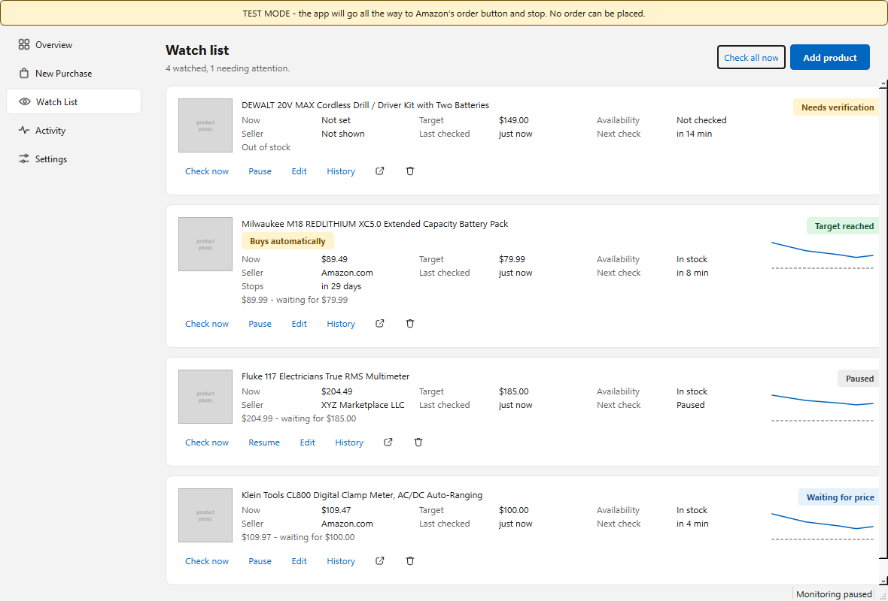
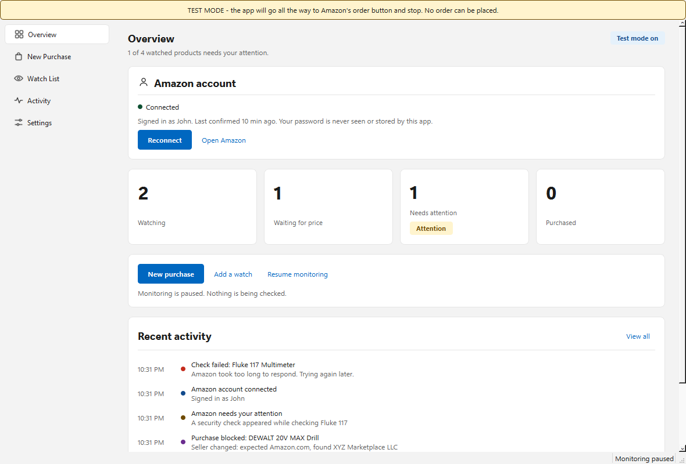
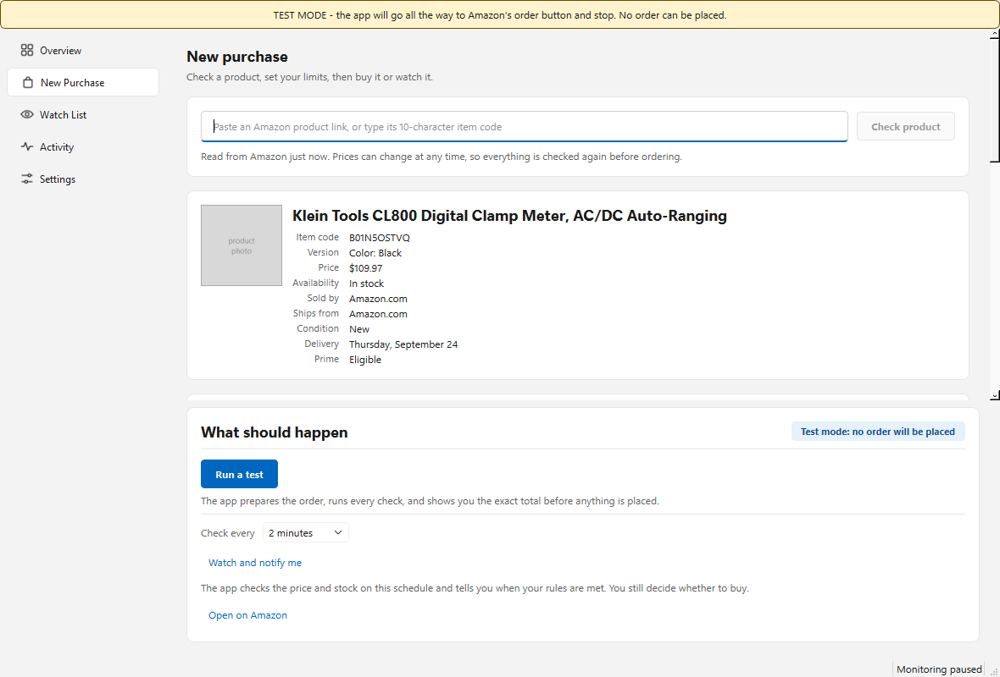
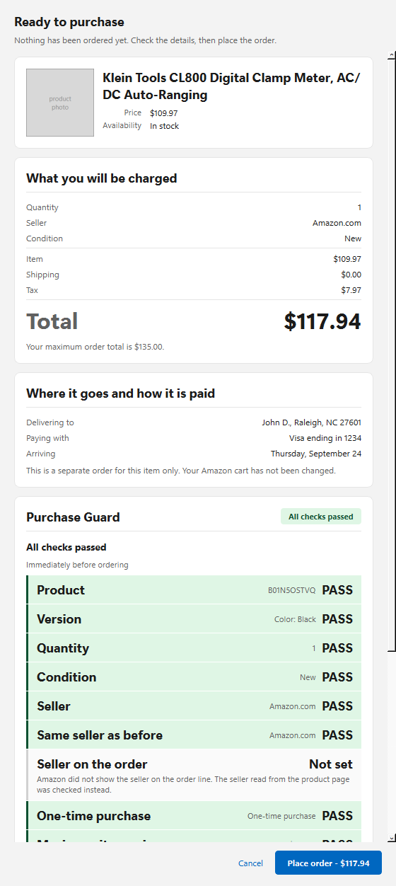
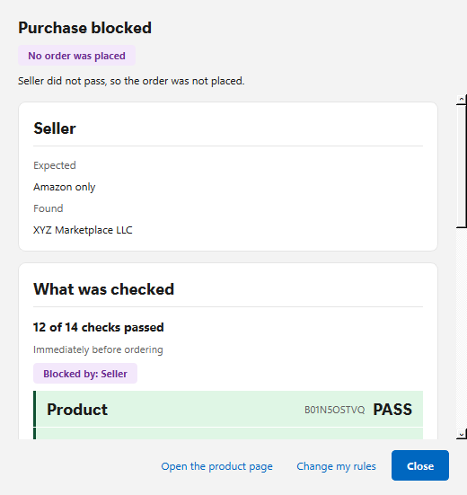

# Cartwright

**A careful hand on your cart.** A Windows desktop application that watches
Amazon products and buys them for you — but only when every rule you set is
still true at the moment of purchase.

[](https://github.com/erasmo0284/cartwright/actions/workflows/tests.yml)
[](LICENSE)
[](#installing)

Built by [@erasmo0284](https://github.com/erasmo0284) · MIT licensed ·
Windows 10/11



---

## What it is

You paste an Amazon product link, set your limits, and choose what should
happen: ask me first, watch and tell me, or buy it automatically. Cartwright
then drives its own private browser — not your Chrome, not your Vivaldi — and
before it will place an order, it checks all of this:

| | |
|---|---|
| The exact product | the item code, and the version (colour, size) you chose |
| The exact quantity | read from the order, or confirmed from the arithmetic |
| Who is selling it | Amazon only, the manufacturer, or a list you approve |
| The condition | new only by default; "Used — Like New" is used, and is refused |
| The item price | at most what you said |
| **The whole order total** | at most what you said, including tax and delivery |
| Where it is going | the delivery address you recorded |
| How it is paid | the payment method you recorded |
| What else is in it | nothing you did not choose, and no protection plans |

If any one of those fails, **it does not buy, and it tells you which rule
stopped it.** There is no setting that lets a purchase through with a warning.

## The part that matters

This program spends real money on a website it does not control, and it is
built around that fact.

- **The decision to buy is deterministic.** One pure function, no I/O, no
  language model, no heuristics, no "looks about right". It is the only thing
  in the program that can authorise a purchase, and assisted and automatic
  purchases go through exactly the same call — there is no weaker path.
- **Absent data fails.** A price that could not be read never becomes
  "probably fine".
- **Test Mode is on when you install it.** It does everything — opens the
  product, goes through checkout, reads the real total, finds Amazon's order
  button — and then stops without clicking it.
- **It never buys twice.** Three database constraints, the submission
  recorded *before* the click, and an interrupted order that becomes
  "outcome unknown" and asks you rather than retrying.
- **It never checks out your existing cart.** Where Amazon offers Buy Now it
  uses that, so your cart is untouched. Otherwise it asks permission to set
  your other items aside, and puts them back afterwards.
- **When Amazon wants a human, it stops and asks you.** No CAPTCHA solving,
  no fingerprint spoofing, no proxy rotation, no pretending to be anything
  other than browser automation.

## Screens

| | |
|---|---|
|  |  |
| The overview | Setting the limits |
|  |  |
| Before anything is ordered | A purchase the rules refused |

Dark mode follows Windows. Every screen and dialog is captured in
[`docs/screens/`](docs/screens), light and dark.

## Installing

Download `Cartwright-<version>-Setup.exe` from
[Releases](https://github.com/erasmo0284/cartwright/releases) and run it. It
installs for the current user, needs no administrator rights, and puts
nothing in Program Files.

Because the installer is not code-signed, Windows will show
"Windows protected your PC" the first time: **More info → Run anyway**.

On first launch Cartwright downloads its own private copy of Chromium
(about 440 MB) into its data folder. That copy is used for nothing else, and
your normal browser is never touched.

## Using it, briefly

1. **Connect your Amazon account.** A browser window opens at Amazon's own
   sign-in page and you sign in there. The application never sees your
   password, and it stores no card details.
2. **Leave Test Mode on** and check a product. You will see everything it
   read, every rule it would enforce, and the real order total — with nothing
   ordered.
3. When you are happy, turn Test Mode off in Settings.

The [user guide](docs/USER_GUIDE.md) covers the rest: the three ways to buy,
what each rule means, what happens when Amazon asks for a code, and what to
do if an order's result is uncertain.

## Before you use this

**Amazon's Conditions of Use restrict automated access to their site.** This
is a personal tool for your own account, and it is deliberately built not to
evade anything: it does not bypass CAPTCHAs, disguise itself, or route around
any protection. Using it is your decision and your responsibility, and
Amazon may withdraw service from an account they believe is automated. Read
[the limitations](docs/KNOWN_LIMITATIONS.md) before trusting it with money.

Cartwright is an independent project. It is not affiliated with, produced by,
endorsed by or connected to Amazon.com, Inc. or any of its subsidiaries.

## Documentation

| | |
|---|---|
| [User guide](docs/USER_GUIDE.md) | How to use it, in plain English |
| [Architecture](docs/ARCHITECTURE.md) | How it is built, and why each safety property holds |
| [Security review](docs/SECURITY.md) | Threat model, what is never stored, what never leaves the machine |
| [Known limitations](docs/KNOWN_LIMITATIONS.md) | An honest list, including what has never been run |
| [Test report](docs/TEST_REPORT.md) | What is tested, what was found by testing, and what is not tested |
| [Build instructions](docs/BUILD.md) | Running from source, and producing the installer |
| [Changelog](CHANGELOG.md) | What changed, and when |

## Running from source

Windows, Python 3.12 or newer:

```bash
git clone https://github.com/erasmo0284/cartwright.git
cd cartwright
py -m venv .venv
.venv\Scripts\python.exe -m pip install -r requirements.txt -r requirements-dev.txt
.venv\Scripts\python.exe -m playwright install chromium
.venv\Scripts\python.exe -m app.main
```

Run the tests:

```bash
.venv\Scripts\python.exe -m pytest tests
```

1,118 tests. The integration tests drive a real Chromium against local
fixture pages with every request intercepted, so they cannot reach Amazon and
cannot place an order. [BUILD.md](docs/BUILD.md) has the rest, including how
the installer is produced.

## How it is built

Python 3.14 · PySide6 (Qt 6) · Playwright · SQLite · PyInstaller · Inno Setup

```
app/automation/   the browser, the selectors, reading Amazon's pages
app/purchasing/   the Purchase Guard, the state machine, the services
app/database/     SQLite, migrations, repositories
app/ui/           screens, dialogs, the theme
app/winint/       tray, notifications, startup, single instance
tests/unit/       fast, no browser
tests/integration/ real Chromium against local fixtures
```

Everything the program knows about Amazon's markup lives in one file,
`app/automation/selectors.py`, as ordered fallback chains. When Amazon
changes, that is the file to edit — and the logs will tell you a fallback was
used before anything goes wrong.

## Contributing

Issues and pull requests are welcome — see
[CONTRIBUTING.md](CONTRIBUTING.md). One rule above all others: **a change
that makes the Purchase Guard more permissive needs a test proving it still
refuses the thing it used to refuse.**

## Credits

Built by [@erasmo0284](https://github.com/erasmo0284).

Standing on: [PySide6](https://doc.qt.io/qtforpython/) (LGPL),
[Playwright](https://playwright.dev/python/) (Apache-2.0),
[windows-toasts](https://github.com/DatGuy1/Windows-Toasts) (Apache-2.0),
[PyInstaller](https://pyinstaller.org/) and
[Inno Setup](https://jrsoftware.org/isinfo.php).

The architecture of the automation layer — ordered selector chains with
telemetry when a fallback is used — is the structure of
[Stagehand](https://github.com/browserbase/stagehand)'s self-healing idea
without the language model, because a purchase decision should not depend on
one.

## Licence

[MIT](LICENSE) © 2026 [@erasmo0284](https://github.com/erasmo0284)
